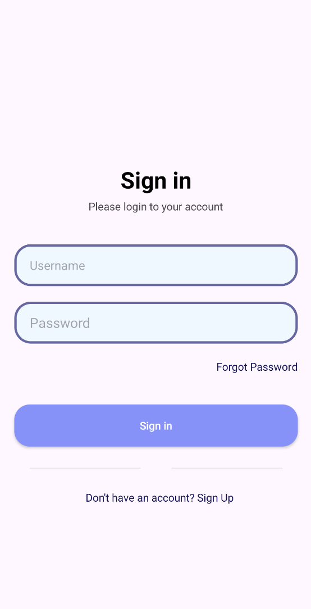
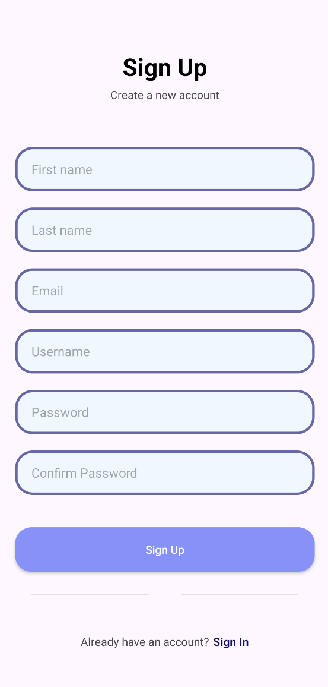
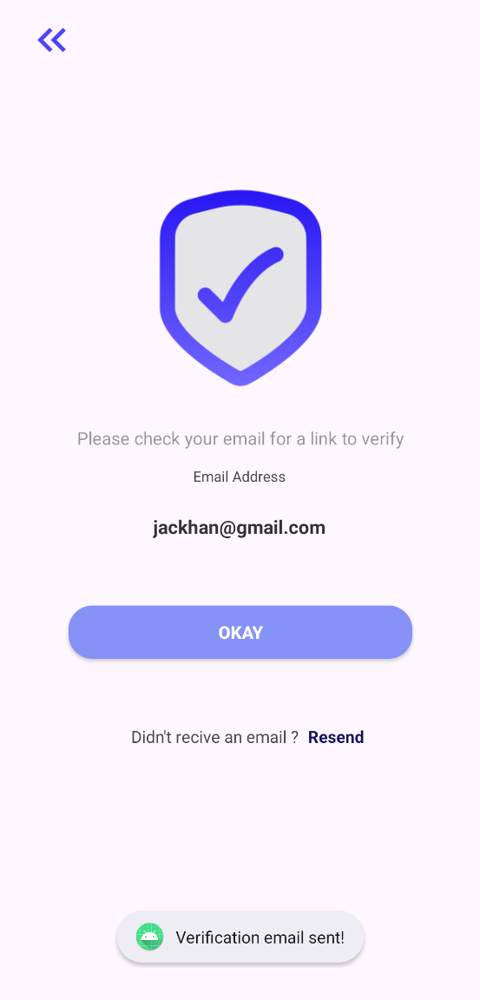
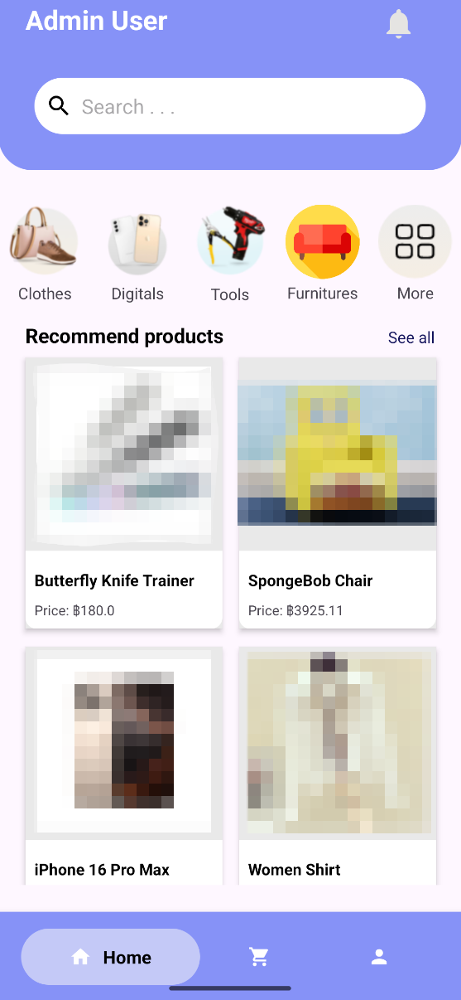
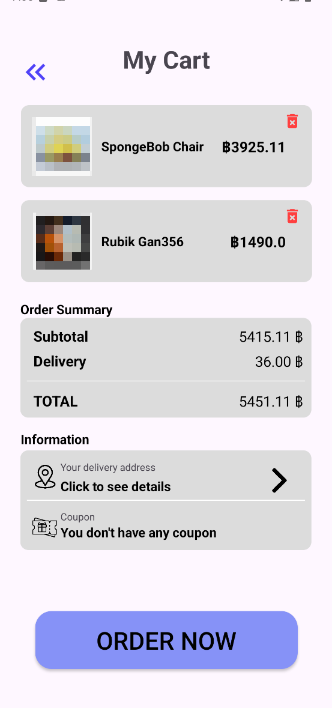
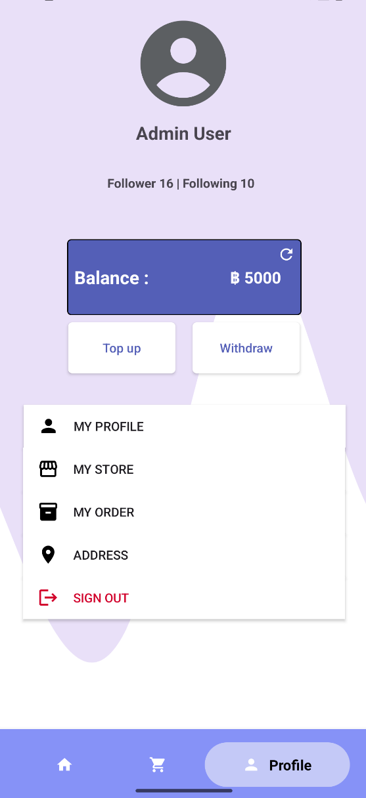
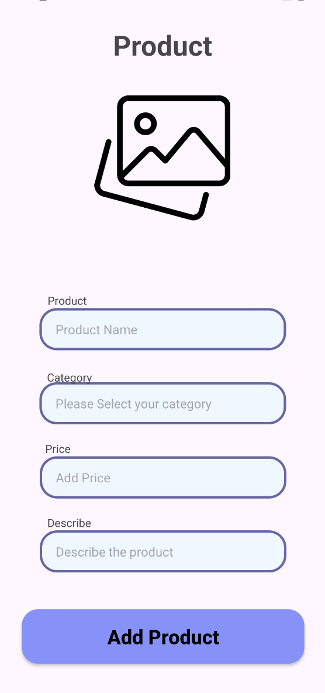
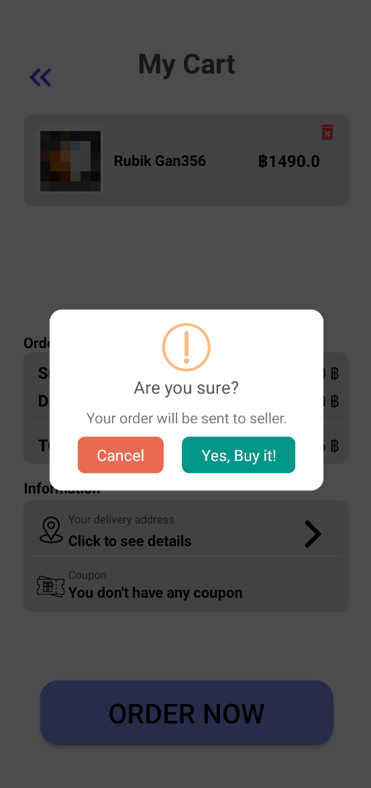

# 🛒 Second Chance Market App

A mobile application for buying and selling second-hand items, developed using **Java** and **Firebase** on **Android Studio**.  
The app supports essential e-commerce features such as product browsing, cart management, and secure user authentication.

---

## 📱 Features

- 🔐 **User Authentication**
  - Sign up / Login with email and password
  - Email verification & password reset
  - Secure connection via Firebase Authentication

- 🛍️ **Product Listing**
  - Add, edit, delete products (with image and category)
  - Browse items by category
  - Real-time updates using Firestore Database

- 🧾 **Cart System**
  - Add/remove products from cart
  - Prepare checkout list

- 🔎 **Search Function**
  - Search products by name or keyword

- 👤 **User Profile**
  - Manage account info
  - View user-specific products

---

## 🛠️ Tech Stack

- **Java** (Android)
- **Firebase Authentication**
- **Cloud Firestore Database**
- **Firebase Storage**
- **Material Design Components**
- **OOP + Clean Code Practices**

---

## 🖼️ Screenshots

| Login | Sign Up | Email Verification |
|-------|---------|--------------------|
|  |  |  |

| Category Page | My Cart | Profile |
|---------------|---------|---------|
|  |  |  |

| Add Product | Popup |
|-------------|--------|
|  |  |

---

## 📌 Note

This app is developed as a university project to explore mobile app development with Firebase backend.  
It focuses on clean code, basic OOP structure, and real-time cloud-based data operations.

